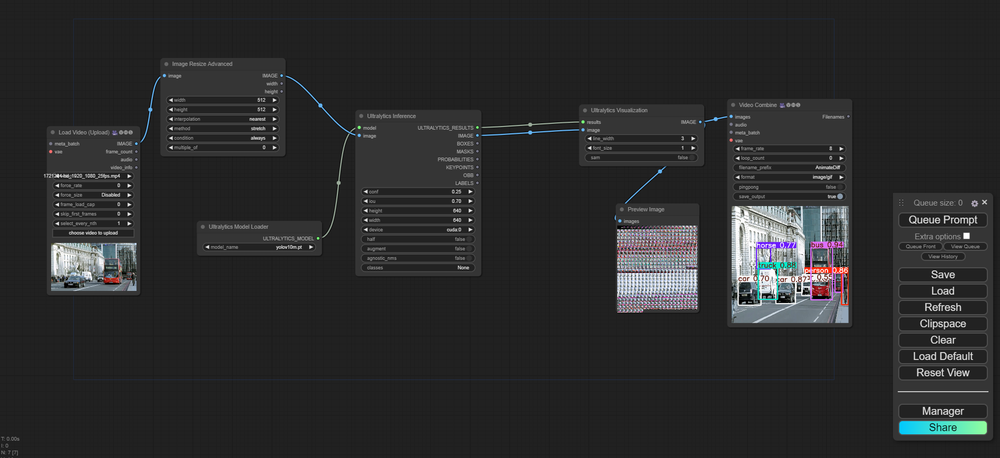

README.md dosyanızın GitHub'da açıldığında bir video oynatılmasını sağlayacak şekilde düzenlenmiş hali:

```markdown
# ComfyUI-Stable-diffusion-generativeAI

video process, img to img upscale, text to img, yolo video process

Bu proje, [Stable Diffusion](https://en.wikipedia.org/wiki/Diffusion_model) modellerinin ComfyUI arayüzlerini içermektedir.

## İçindekiler
- [Kurulum](#kurulum)
- [Özellikler](#özellikler)
- [Video Tanıtımı](#video-tanıtımı)
- [Katkıda Bulunma](#katkıda-bulunma)

## Kurulum

```bash
git clone https://github.com/osmantemel/ComfyUI-Stable-diffusion-generativeAI.git
cd ComfyUI-Stable-diffusion-generativeAI
code .
```

## Özellikler

- Video işleme
- Görüntüden görüntüye yükseltme (upscale)
- Metinden görüntüye dönüşüm
- YOLO ile video işleme

## Video Tanıtımı

[](./img_video/yolovideo.mp4)

<video controls autoplay>
  <source src="./img_video/yolovideo.mp4" type="video/mp4">
  Tarayıcınız video etiketini desteklemiyor.
</video>

## Katkıda Bulunma

Katkıda bulunma yönergelerini burada açıklayın. Örneğin:

1. Fork yapın
2. Yeni bir dal oluşturun (`git checkout -b özellik-adi`)
3. Değişikliklerinizi commit edin (`git commit -am 'Özellik ekle'`)
4. Dalınıza push edin (`git push origin özellik-adi`)
5. Bir Pull Request oluşturun
```
